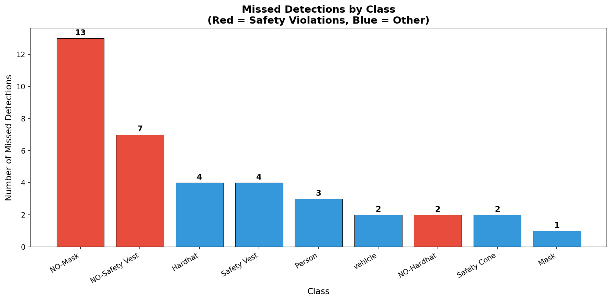

# Construction Site Safety — YOLO11 Failure Analysis

A systematic failure analysis of a YOLO11 model trained on construction site safety data. This project goes beyond headline metrics to understand *where and why* the model fails — with a focus on safety-critical violation detection.

---

## Key Findings

> A model with **81% mAP50** missed safety violations **58% of the time** — high overall accuracy does not guarantee reliable detection where it matters most.

### Finding 1: Violation Detection Gap
The model is systematically better at detecting *compliant* workers than *non-compliant* ones:

| Class | mAP50 | Recall |
|---|---|---|
| Hardhat ✅ | 0.916 | 0.820 |
| Mask ✅ | 0.855 | 0.857 |
| Safety Vest ✅ | 0.890 | 0.842 |
| **NO-Hardhat ❌** | **0.656** | **0.580** |
| **NO-Mask ❌** | **0.759** | **0.635** |
| **NO-Safety Vest ❌** | **0.800** | **0.736** |

### Finding 2: Dataset Noise
Manual inspection of failure images revealed out-of-domain images in the dataset — urban streets, indoor scenes, and a boat race — contributing to unreliable detections.

---

## Missed Detections by Class



Of **38 total missed detections** across 113 validation images:
- NO-Mask: **13 misses**
- NO-Safety Vest: **7 misses**
- NO-Hardhat: **2 misses**

**22 out of 38 misses were safety violations** — the exact detections a real safety system needs most.

---

## Failure Examples


---

## Setup & Usage

### Requirements
```bash
pip install ultralytics roboflow supervision matplotlib pandas
```

### Dataset
This project uses Roboflow's [Construction Site Safety dataset](https://universe.roboflow.com/roboflow-universe-projects/construction-site-safety).

You'll need a free Roboflow account and API key to download it.

### Run the Notebook
1. Open `notebook.ipynb` in Google Colab
2. Enable T4 GPU: Runtime → Change Runtime Type → T4 GPU
3. Add your Roboflow API key to Colab Secrets as `ROBOFLOW_API_KEY`
4. Run all cells in order

---

## Model Details

| Parameter | Value |
|---|---|
| Model | YOLO11s |
| Dataset | Construction Site Safety (v24) |
| Training Images | 2,767 |
| Validation Images | 113 |
| Epochs | 50 |
| Image Size | 640x640 |
| Hardware | Google Colab T4 GPU |
| Training Time | ~45 minutes |

---

## Overall Results

| Metric | Score |
|---|---|
| mAP50 | 0.810 |
| mAP50-95 | 0.530 |
| Precision | 0.903 |
| Recall | 0.743 |

---

## Why This Matters Beyond Construction

This failure pattern generalizes to any safety-critical CV application:

- **Medical imaging** — detecting abnormalities vs healthy tissue
- **Manufacturing QA** — detecting defects vs good parts
- **Retail security** — detecting suspicious vs normal behavior

In any domain where you're detecting violations or anomalies, always check per-class recall — not just overall mAP.

---

## What I'd Do Next

1. **Oversample violation classes** during training to fix class imbalance
2. **Clean the dataset** — remove out-of-domain images
3. **Use mAP50-95 as primary metric** for safety-critical systems
4. **Weight recall higher** for violation classes — missing a violation is more dangerous than a false alarm

---

## Project Structure

```
construction-safety-failure-analysis/
│
├── notebook.ipynb          # Full analysis notebook
├── README.md               
├── images/
│   ├── missed_detections_chart.png
│   └── failure_examples.png
├── failures_analysis.csv   # Per-image failure data
└── .gitignore
```

---

## Acknowledgements

Dataset provided by [Roboflow Universe](https://universe.roboflow.com/roboflow-universe-projects/construction-site-safety). Thanks to the Roboflow team for making high quality open datasets available to the community.

---

## License
MIT
